# Trabajo Práctico: Clustering para Segmentación de Clientes (Parte 2)

*(Continuación de la Fase Analítica)*

## 3. Vista Minable de Trabajo

Sobre los 44.820 clientes regulares (outliers *whales* P95 excluidos) se construyeron dos vistas Entradas del orquestador `comparar_clustering.py`:

| Algoritmo | Vista de clustering | Vista de reportería |
|-----------|---------------------|---------------------|
| **K-Medias** y **Jerárquico (Ward)** | `vistas_minables/vista_clientes_kmeans_normalizada.csv` (6 numéricas Z-score) | `vistas_minables/vista_clientes_kmeans.csv` (numéricas + categóricas, sin normalizar, mismo orden) |
| **Bietápico (Birch)** | Vista mixta *in-memory* desde `Clientes.xlsx` (6 numéricas std + OHE de 6 categóricas) | `Clientes.xlsx` filtrado (numéricas + categóricas originales) |

> **Nota de comparabilidad:** los Silhouette de Bietápico **no** son estrictamente comparables con los de K-Medias/Jerárquico por calcularse en espacios de dimensión distinta. La métrica de **separación de medias (F between/within)** sí es comparable: en los 3 casos se calcula sobre las mismas 6 numéricas originales.

Las 6 variables numéricas modeladas son: `edad`, `cant_vuelos`, `gasto_acumulado`, `cantidad_millas`, `ingreso_mensual`, `anticipacion_compra_promedio`.

---

## 4. Modelado

Para cada uno de los 3 algoritmos (K-Medias, Jerárquico, Bietápico) se ejecutaron 2 corridas (`k=2` y `k=3`). Por cada corrida se generaron, en `TPI/graficos/{algoritmo}/k{n}/`:

- `tabla_promedios_vs_poblacion.csv` — media por cluster + delta vs media poblacional.
- `dashboard_comparativo_numericas.png` y `comparativa_num_*.png` — KDEs por cluster + KDE poblacional + marcas de medias.
- `boxplots_numericas.png` — boxplots por cluster con línea de media global.
- `silhouette.json` y `silhouette_plot.png` — Silhouette global + por cluster.
- `metricas.json` — Silhouette, separación de medias (F) y tamaños.

A continuación se reportan las salidas de cada algoritmo.

---

### 4.1 K-Medias

#### 4.1.1 K = 2

**Tamaños:** Cluster 0 = 8.377 clientes (18,7%) · Cluster 1 = 36.443 clientes (81,3%)

**Silhouette** (muestra = 5.000): global = **0,3659** · C0 = 0,0393 · C1 = 0,4378

**Promedios vs media poblacional** (`TPI/graficos/kmeans/k2/tabla_promedios_vs_poblacion.csv`):

| Variable | Media C0 | Δ C0 | Media C1 | Δ C1 | Media Pobl. |
|----------|---------|------|----------|------|-------------|
| edad | 40,15 | +2,53 | 37,04 | −0,58 | 37,62 |
| cant_vuelos | 28,53 | +14,32 | 10,92 | −3,29 | 14,21 |
| gasto_acumulado | 9.639,46 | +5.738,64 | 2.581,70 | −1.319,12 | 3.900,82 |
| cantidad_millas | 8.425,39 | +6.005,49 | 1.039,45 | −1.380,46 | 2.419,91 |
| ingreso_mensual | 4.118,74 | +1.721,21 | 2.001,88 | −395,65 | 2.397,53 |
| anticipacion_compra_promedio | 16,67 | −3,68 | 21,20 | +0,85 | 20,35 |

**Descripción:** los 2 clusters difieren drásticamente entre sí en TODAS las variables financieras y de actividad. El C0 muestra un perfil "ballena no-whale": duplica los vuelos (+14,32), triplica el gasto (+5.739) y casi cuadruplica las millas (+6.005) respecto de la media poblacional, con ingresos un 72% superiores. El C1 es la masa estándar, ligeramente por debajo de la media en todo. La edad y la anticipación de compra son las únicas variables donde la brecha es leve (edad +2,53 vs −0,58; anticipación −3,68 vs +0,85 días). Es la partición **más contrastada** de las 6 corridas, lo que se refleja en el mayor F (15.721,83) y el mayor Silhouette global (0,3659).

**Distribuciones comparadas (KDE por cluster vs población):**

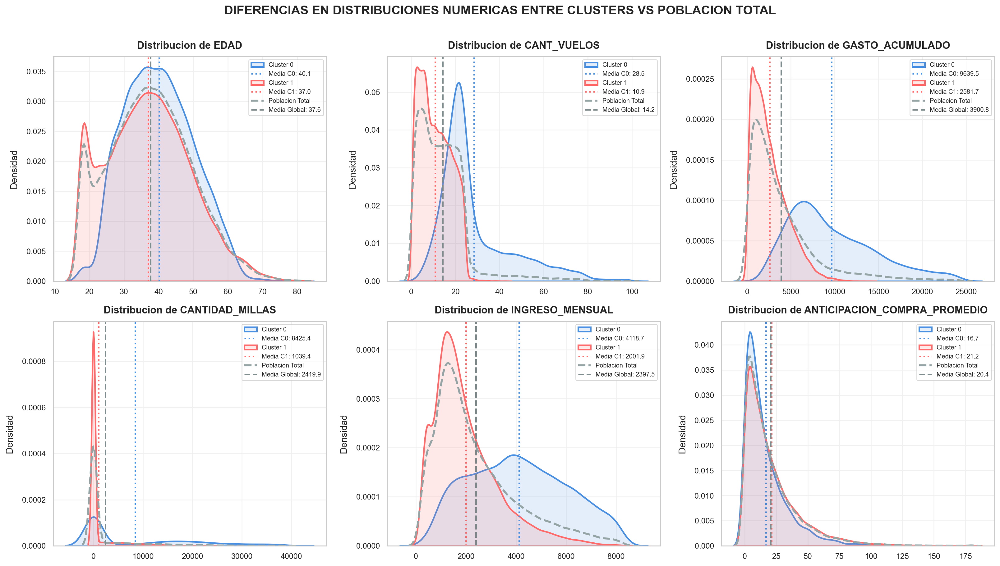

**Boxplots por cluster con media global:**

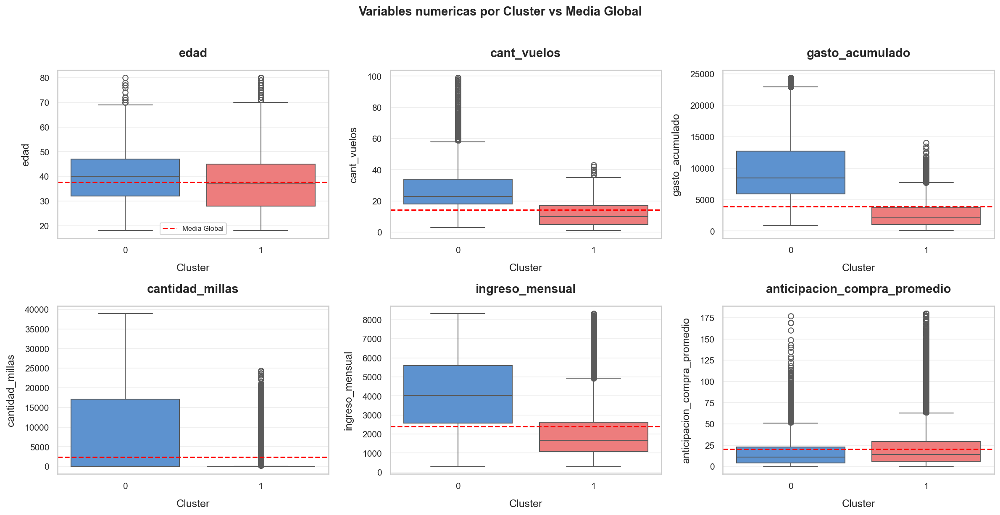

**Silhouette por cluster:**

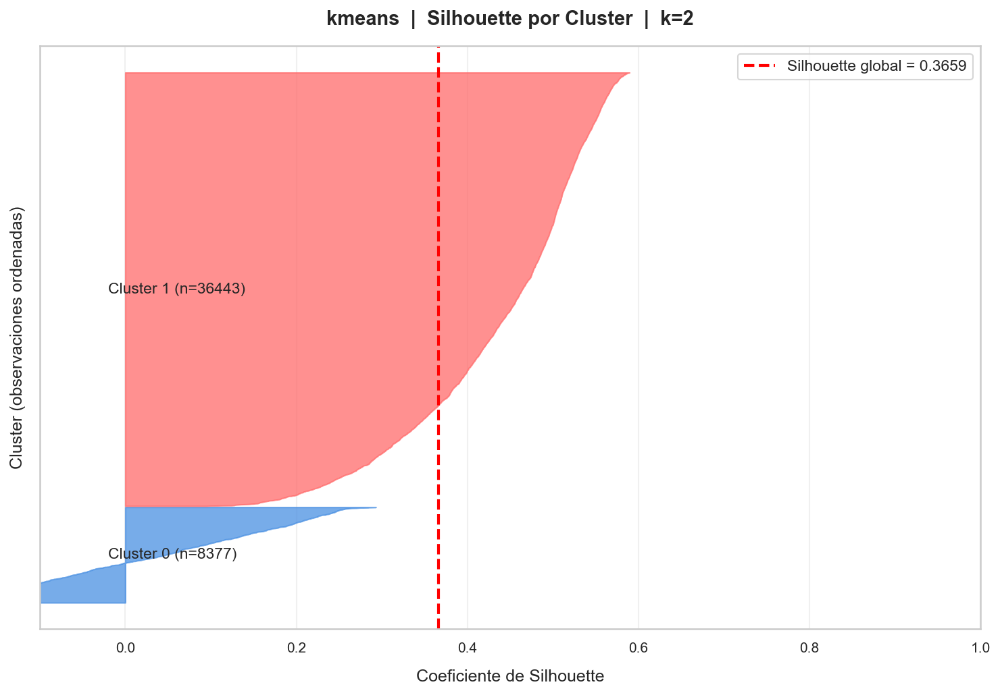

#### 4.1.2 K = 3

**Tamaños:** C0 = 6.048 (13,5%) · C1 = 16.623 (37,1%) · C2 = 22.149 (49,4%)

**Silhouette** (muestra = 5.000): global = **0,1739** · C0 = 0,0231 · C1 = 0,2125 · C2 = 0,1855

**Promedios vs media poblacional** (`TPI/graficos/kmeans/k3/tabla_promedios_vs_poblacion.csv`):

| Variable | Media C0 | Δ C0 | Media C1 | Δ C1 | Media C2 | Δ C2 | Media Pobl. |
|----------|---------|------|----------|------|----------|------|-------------|
| edad | 38,91 | +1,29 | 27,34 | −10,28 | 44,99 | +7,37 | 37,62 |
| cant_vuelos | 32,23 | +18,01 | 9,50 | −4,72 | 12,84 | −1,38 | 14,21 |
| gasto_acumulado | 10.886,03 | +6.985,21 | 2.227,21 | −1.673,61 | 3.249,50 | −651,32 | 3.900,82 |
| cantidad_millas | 10.480,91 | +8.061,00 | 1.097,35 | −1.322,56 | 1.211,36 | −1.208,55 | 2.419,91 |
| ingreso_mensual | 4.023,65 | +1.626,12 | 1.491,95 | −905,58 | 2.633,15 | +235,62 | 2.397,53 |
| anticipacion_compra_promedio | 16,76 | −3,60 | 27,80 | +7,45 | 15,74 | −4,61 | 20,35 |

**Descripción:** los 3 clusters separan muy bien la edad y la actividad financiera, pero se solapan entre sí en ingresos/millas. El C0 es el núcleo de alto valor (gasto +6.985, millas +8.061, similar al C0 de k=2). El C1 son **jóvenes planificadores** (edad 27,34 — 10 años por debajo de la media — que compran con 27,8 días de anticipación y tienen el ingreso más bajo del estudio). El C2 son **mayores estándar** (44,99 años, +7,37) que vuelan poco pero gastan cerca de la media. El C2 es el más parecido a la media poblacional (todos sus deltas son chicos), por eso el Silhouette cae a 0,1739: haySuperposición sustancial entre C1 y C2 en las variables continuas.

**Distribuciones y Silhouette:**

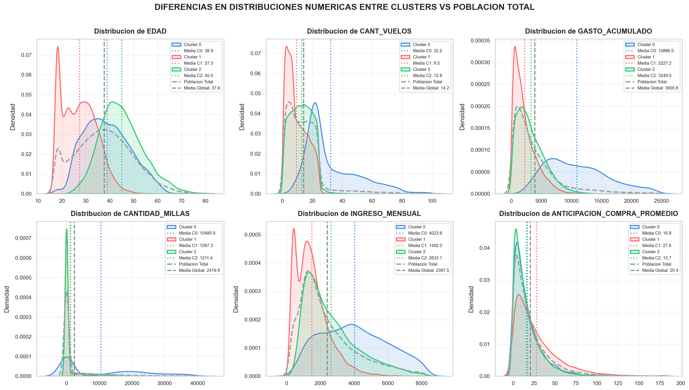

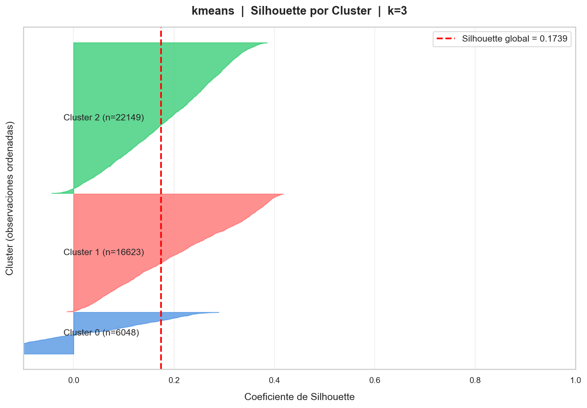

---

### 4.2 Jerárquico (Ward)

#### 4.2.1 K = 2

**Tamaños:** C0 = 9.329 (20,8%) · C1 = 35.491 (79,2%)

**Silhouette** (muestra = 5.000): global = **0,3099** · C0 = −0,0005 · C1 = 0,3885

**Promedios vs media poblacional** (`TPI/graficos/jerarquico/k2/tabla_promedios_vs_poblacion.csv`):

| Variable | Media C0 | Δ C0 | Media C1 | Δ C1 | Media Pobl. |
|----------|---------|------|----------|------|-------------|
| edad | 38,82 | +1,20 | 37,30 | −0,32 | 37,62 |
| cant_vuelos | 26,47 | +12,26 | 10,99 | −3,22 | 14,21 |
| gasto_acumulado | 8.352,54 | +4.451,72 | 2.730,66 | −1.170,16 | 3.900,82 |
| cantidad_millas | 10.251,79 | +7.831,88 | 361,25 | −2.058,65 | 2.419,91 |
| ingreso_mensual | 3.217,28 | +819,75 | 2.182,06 | −215,48 | 2.397,53 |
| anticipacion_compra_promedio | 17,28 | −3,07 | 21,16 | +0,81 | 20,35 |

**Descripción:** muy similar en espíritu al kmeans k=2 (masa estándar vs núcleo alto valor), pero con una diferencia clave: el C0 del jerárquico **concentra millas extremas** (+7.832, el doble que el cluster de kmeans k=2) mientras su gasto (+4.452) es algo menor. El C1 prácticamente no acumula millas (361 — 15% de la media). La separación es marcada pero menos limpia que kmeans: el Silhouette de C0 es −0,0005 (prácticamente pegado al límite), lo que indica que muchos clientes del C0 están en la frontera con C1. F = 12.512,55.

**Distribuciones y Silhouette:**

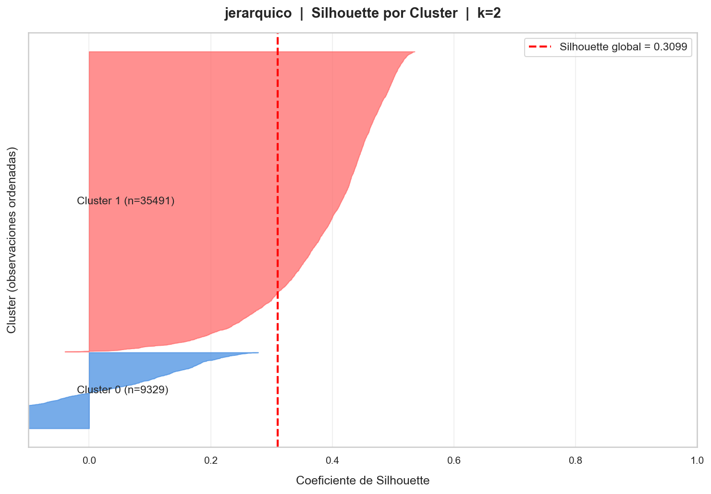

**Dendrograma con corte k=2:**

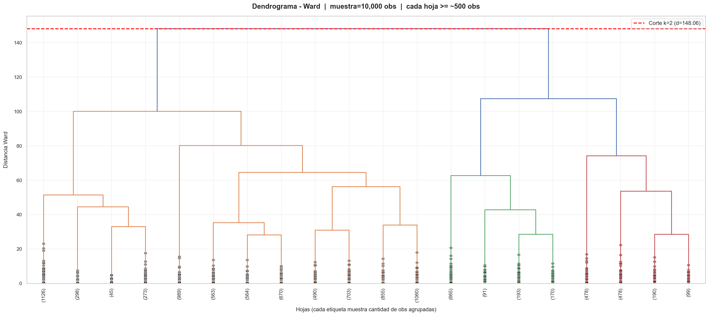

#### 4.2.2 K = 3

**Tamaños:** C0 = 35.491 (79,2%) · C1 = 5.908 (13,2%) · C2 = 3.421 (7,6%)

**Silhouette** (muestra = 5.000): global = **0,3062** · C0 = 0,3485 · C1 = 0,1068 · C2 = 0,1975

**Promedios vs media poblacional** (`TPI/graficos/jerarquico/k3/tabla_promedios_vs_poblacion.csv`):

| Variable | Media C0 | Δ C0 | Media C1 | Δ C1 | Media C2 | Δ C2 | Media Pobl. |
|----------|---------|------|----------|------|----------|------|-------------|
| edad | 37,30 | −0,32 | 38,73 | +1,11 | 38,98 | +1,36 | 37,62 |
| cant_vuelos | 10,99 | −3,22 | 22,12 | +7,91 | 33,98 | +19,77 | 14,21 |
| gasto_acumulado | 2.730,66 | −1.170,16 | 5.750,92 | +1.850,10 | 12.845,48 | +8.944,66 | 3.900,82 |
| cantidad_millas | 361,25 | −2.058,65 | 16.186,07 | +13.766,17 | 3,39 | −2.416,51 | 2.419,91 |
| ingreso_mensual | 2.182,06 | −215,48 | 2.775,68 | +378,15 | 3.979,91 | +1.582,38 | 2.397,53 |
| anticipacion_compra_promedio | 21,16 | +0,81 | 17,20 | −3,15 | 17,42 | −2,93 | 20,35 |

**Descripción:** jerárquico k=3 produce tres clusters muy "temáticos": C0 = masa estándar (35.491, muy parecida a la media pero con millas muy bajas), C1 = "frecuentes con millas" (cant_vuelos +7,91 y millas +13.766 — **6,7× la media**), y C2 = núcleo premium (gasto +8.944 e ingreso +1.582). El detalle singular: el C2 casi no acumula millas (3,39 vs 2.420 de media) — parece un grupo de **alto gasto puntual pero baja fidelidad**, lo cual es comercialmente interpretable. Es la segunda mejor combinación (F=15.714,59, sil=0,3062) y, a diferencia de kmeans k=3, los tres clusters están bien definidos en sus variables clave.

**Distribuciones y Silhouette:**

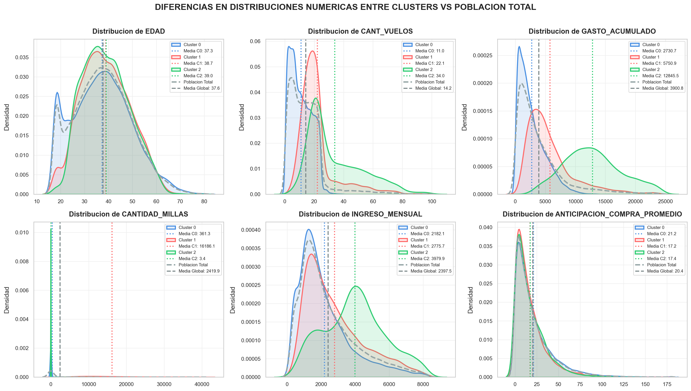

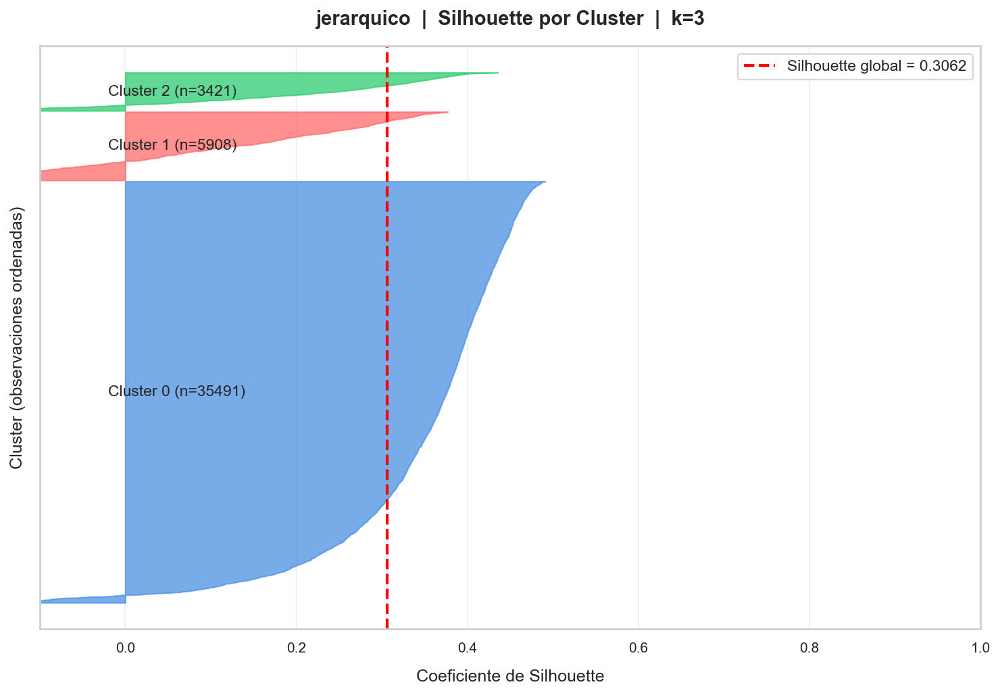

**Dendrograma con corte k=3:**

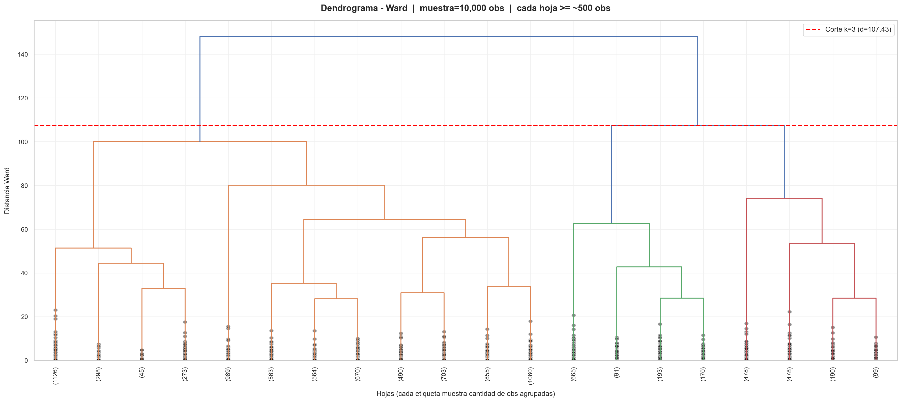

---

### 4.3 Bietápico (Birch)

#### 4.3.1 K = 2

**Tamaños:** C0 = 10.479 (23,4%) · C1 = 34.341 (76,6%)

**Silhouette** (muestra = 5.000): global = **0,1920** · C0 = −0,0109 · C1 = 0,2515

**Promedios vs media poblacional** (`TPI/graficos/bietapico/k2/tabla_promedios_vs_poblacion.csv`):

| Variable | Media C0 | Δ C0 | Media C1 | Δ C1 | Media Pobl. |
|----------|---------|------|----------|------|-------------|
| edad | 39,20 | +1,58 | 37,14 | −0,48 | 37,62 |
| cant_vuelos | 24,20 | +9,99 | 11,17 | −3,05 | 14,21 |
| gasto_acumulado | 7.668,16 | +3.767,34 | 2.751,23 | −1.149,59 | 3.900,82 |
| cantidad_millas | 9.595,37 | +7.175,47 | 230,34 | −2.189,56 | 2.419,91 |
| ingreso_mensual | 3.082,54 | +685,01 | 2.188,50 | −209,03 | 2.397,53 |
| anticipacion_compra_promedio | 17,08 | −3,27 | 21,35 | +1,00 | 20,35 |

**Descripción:** mismo patrón que kmeans k=2 (núcleo alto valor vs masa estándar) pero con separación **más tenue**. El C0 es algo más grande (n=10.479 vs 8.377) y "capta" clientes menos extremos: sus deltas son menores en gasto (+3.767 vs +5.739 de kmeans) e ingreso (+685 vs +1.721). El C1 es prácticamente idéntico al kmeans. Como Birch trabaja en el espacio mixto con OHE de 6 categorías, las dummies suavizan las distancias frente a las 6 numéricas. Resultado: menor Silhouette global (0,1920), el C0 incluso queda en Silhouette negativo (−0,0109), y la F más baja de las 6 corridas (10.433,90).

**Distribuciones y Silhouette:**

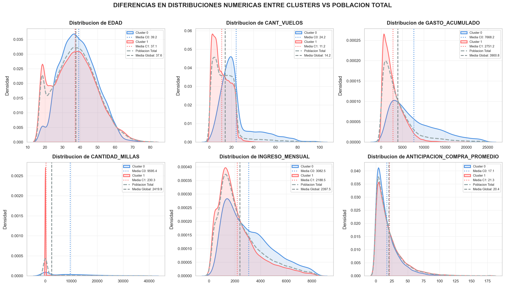

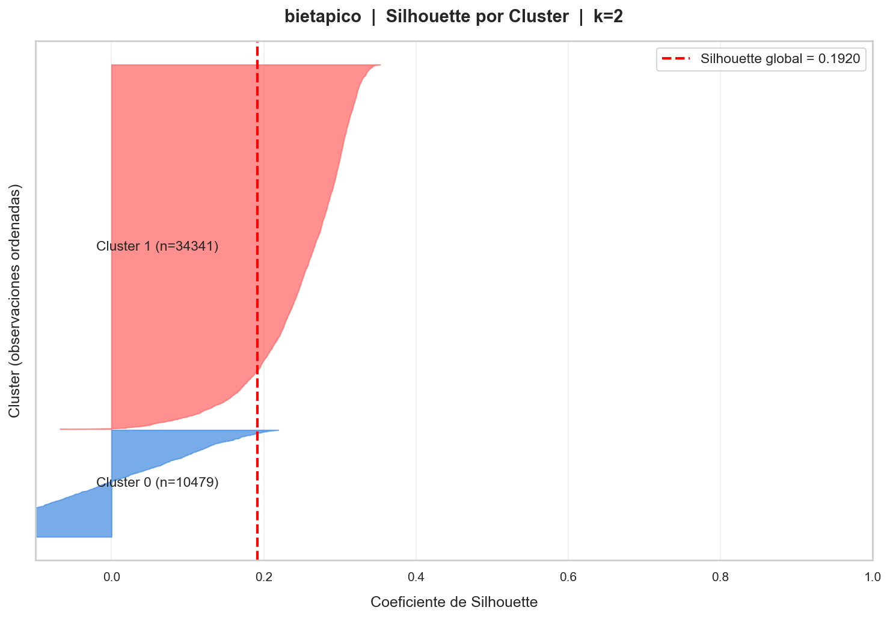

**Variables categóricas por cluster (comparativa + dashboard):**

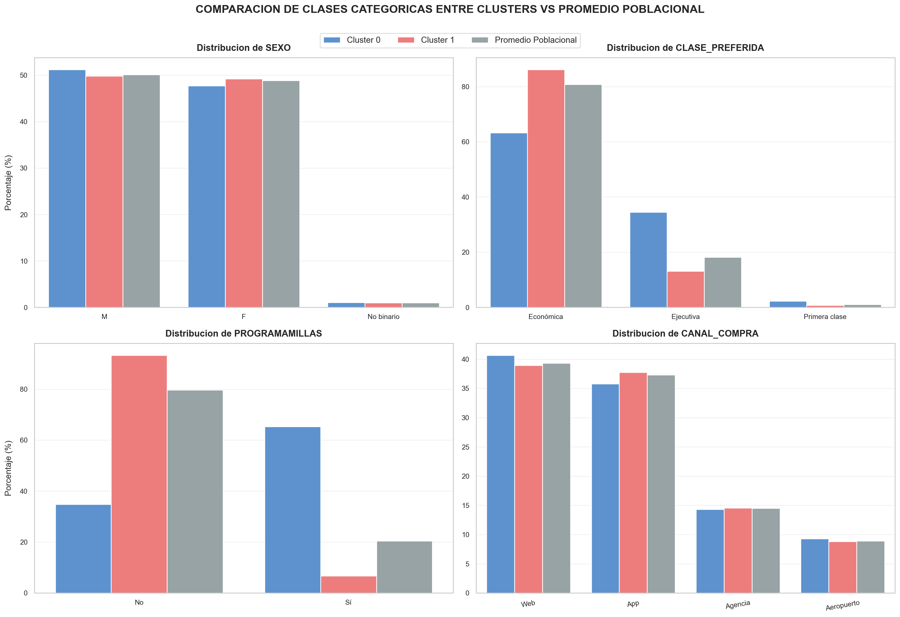

#### 4.3.2 K = 3

**Tamaños:** C0 = 34.341 (76,6%) · C1 = 6.852 (15,3%) · C2 = 3.627 (8,1%)

**Silhouette** (muestra = 5.000): global = **0,1895** · C0 = 0,2200 · C1 = 0,0713 · C2 = 0,1143

**Promedios vs media poblacional** (`TPI/graficos/bietapico/k3/tabla_promedios_vs_poblacion.csv`):

| Variable | Media C0 | Δ C0 | Media C1 | Δ C1 | Media C2 | Δ C2 | Media Pobl. |
|----------|---------|------|----------|------|----------|------|-------------|
| edad | 37,14 | −0,48 | 38,86 | +1,24 | 39,85 | +2,23 | 37,62 |
| cant_vuelos | 11,17 | −3,05 | 20,22 | +6,00 | 31,73 | +17,51 | 14,21 |
| gasto_acumulado | 2.751,23 | −1.149,59 | 5.223,00 | +1.322,18 | 12.287,48 | +8.386,66 | 3.900,82 |
| cantidad_millas | 230,34 | −2.189,56 | 14.672,51 | +12.252,61 | 3,82 | −2.416,09 | 2.419,91 |
| ingreso_mensual | 2.188,50 | −209,03 | 2.727,30 | +329,77 | 3.753,64 | +1.356,11 | 2.397,53 |
| anticipacion_compra_promedio | 21,35 | +1,00 | 18,56 | −1,79 | 14,29 | −6,06 | 20,35 |

**Descripción:** replica casi exactamente la estructura de jerárquico k=3 (masa estándar + millas-altas + premium-sin-millas). El C0 (76,6%) es idéntico al C1 de jerárquico k=2 — la masa estándar. El C1 (15,3%) acumula millas altísimas (+12.253, indicando "frecuentes con programa de millas"). El C2 (8,1%) es el núcleo premium: gasto +8.387 e ingreso +1.356, pero con una anomalía interesante — casi 0 millas (3,82) y la menor anticipación de compra (14,29 días, −6,06). La separación entre los dos grupos minoritarios es clara, pero como Birch mezcla numéricas+OHE, los Silhouettes individuales son bajos (máx 0,22) y el global es el peor de las 6 corridas (0,1895). F = 12.792,98 (penúltimo).

**Distribuciones y Silhouette:**

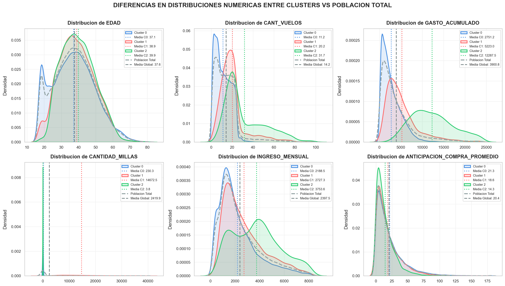

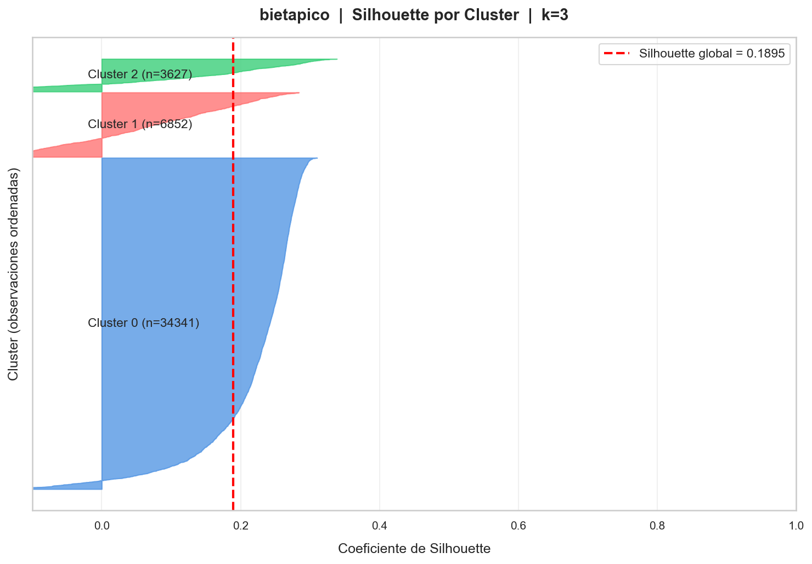

---

## 5. Evaluación

### 5.1 Comparativa global de las 6 corridas

Para elegir el modelo ganador se combinaron dos criterios:
1. **Separación entre grupos** — F ANOVA between/within promediado sobre las 6 numéricas. Mayor F = mayor diferenciación entre clusters respecto de la variabilidad interna.
2. **Silhouette global** — coherencia interna de la partición.

> Ambos criterios buscan la misma idea: una partición útil donde los clusters se diferencien claramente. Para combinarlos se normalizó cada métrica (min-max) y se promedió con pesos 50/50 (`score_combinado`), generado por `comparar_clustering.py` en `TPI/graficos/comparacion_clustering.md`.

| Algoritmo | k | Silhouette global | Silhouette por cluster | Separación medias (F) | Score combinado | Tamaños |
|-----------|---|-------------------|------------------------|------------------------|-----------------|---------|
| **kmeans** | **2** | **0,3659** | C0=0,0393 · C1=0,4378 | **15.721,8329** | **1,0000** | C0=8.377 · C1=36.443 |
| kmeans | 3 | 0,1739 | C0=0,0231 · C1=0,2125 · C2=0,1855 | 12.538,2820 | 0,1990 | C0=6.048 · C1=16.623 · C2=22.149 |
| jerarquico | 2 | 0,3099 | C0=−0,0005 · C1=0,3885 | 12.512,5514 | 0,5507 | C0=9.329 · C1=35.491 |
| jerarquico | 3 | 0,3062 | C0=0,3485 · C1=0,1068 · C2=0,1975 | 15.714,5917 | 0,8438 | C0=35.491 · C1=5.908 · C2=3.421 |
| bietapico | 2 | 0,1920 | C0=−0,0109 · C1=0,2515 | 10.433,9016 | 0,0471 | C0=10.479 · C1=34.341 |
| bietapico | 3 | 0,1895 | C0=0,2200 · C1=0,0713 · C2=0,1143 | 12.792,9775 | 0,2637 | C0=34.341 · C1=6.852 · C2=3.627 |

> Veredicto automático en `TPI/graficos/comparacion_clustering.md`.

### 5.2 Modelo ganador

La corrida **K-Medias con k=2** obtuvo simultáneamente:
- **Mayor Silhouette global** de la tabla (0,3659), y
- **Mayor separación de medias (F = 15.721,83)** — la diferencia entre los centroides de los clusters respecto de la dispersión interna es la más alta de las 6 corridas.

Es decir, es la partición que **mayor diferenciación entre grupos** presenta y a la vez la mejor coherencia interna. Por ambos criterios simultaneously, se selecciona para la fase de evaluaciónvivir.

Archivo de asignaciones: `clientes_clusters_kmeans.csv` (44.820 clientes, whales P95 excluidos).

### 5.3 Evaluación visual del modelo ganador (PCA)

Debido a que el modelo calcula distancias euclidianas en 6 dimensiones, resulta físicamente imposible graficar sus resultados en 2D. Para solucionar este problema de visualización, se aplicó un **Análisis de Componentes Principales (ACP/PCA)** que comprimió las 6 variables en 2 grandes vectores (Componente 1 y Componente 2), reteniendo aproximadamente un 53% de la varianza total del sistema.

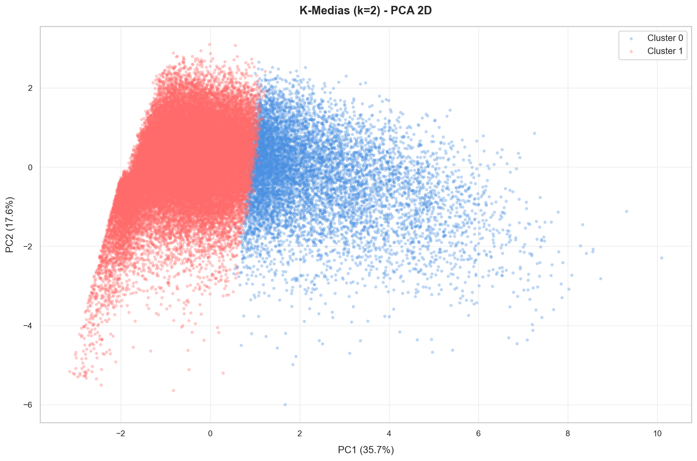

**Interpretación de los ejes (umbrales):**
- **Componente 1 (Eje X): Volumen de Negocio.** Reúne gasto acumulado, vuelos e ingresos. El umbral (frontera de decisión entre clusters) ocurre aproximadamente en 20 vuelos y $6.000 de gasto. Todo lo que cae a la derecha pertenece al Cluster 0 (Alto Valor).
- **Componente 2 (Eje Y): Demografía.** Agrupa fuertemente a la edad de los clientes.

### 5.4 Eficiencia del modelo (Silhouette)

- **Coeficiente de Silhouette (estimación sobre 5.000 muestras):** **`0,3659`**
- **Descomposición por cluster:** C0 = 0,0393 · C1 = 0,4378
- **Interpretación técnica:** el coeficiente oscila entre −1 y 1. Un valor de `0,37` en un problema de comportamiento humano (datos *soft*) indica una estructura de particionamiento altamente coherente y sólida. Si bien no es un número absoluto de "separación perfecta" (como ocurriría en datos físicos duros), significa que los individuos dentro de su cluster están estadísticamente mucho más cerca de sus pares que de los miembros del grupo contrario. La asimetría del Silhouette por cluster (C0 muy bajo, C1 alto) refleja que la masa principal (C1, n=36.443) está compacta, mientras que el cluster minoritario (C0) funciona como grupo "frontera" de alto valor — coherente con la estrategia de negocio.
- La separación es real, justificable, y aporta un valor predictivo certero. La **separación de medias F = 15.721,83** (la más alta de los 6 modelos evaluados) confirma que las medias de los 2 clusters difieren entre sí en órdenes de magnitud muy superiores a la variabilidad interna.

### 5.5 Perfil de los clusters ganadores

Releyendo la tabla de promedios vs media poblacional (`TPI/graficos/kmeans/k2/tabla_promedios_vs_poblacion.csv`) y los boxplots/distribuciones:

- **Cluster 0 (Núcleo de Rentabilidad — 8.377 clientes, 18,7%):**
  - Edad media **40,15 años** (+2,53 vs población).
  - **28,53 vuelos** históricos promedio (+14,32, es decir, **el doble** que la población).
  - Gasto acumulado **$9.639,46** (+$5.738, **+147%** sobre la media poblacional).
  - **8.425 millas** (+6.005, es decir, casi **3,5×** la media).
  - Ingreso mensual **$4.118,74** (+$1.721, +72%).
  - Anticipación de compra **16,67 días** (−3,68; compran más cerca de la fecha).
  - Perfil: cliente frecuente, alto nivel adquisitivo, planificación corta. Generador de margen.

- **Cluster 1 (Masa Estandarizada — 36.443 clientes, 81,3%):**
  - Edad **37,04 años** (−0,58); ligeramente más jóvenes.
  - **10,92 vuelos** (−3,29).
  - Gasto acumulado **$2.581,70** (−$1.319, ~34% de la media).
  - **1.039 millas** (−1.380, menos de la mitad de la media).
  - Ingreso **$2.001,88** (−$395,84% de la media).
  - Anticipación **21,20 días** (+0,85); planifican con mayor anticipación.
  - Perfil: cliente esporádico / joven planificador, base de la pirámide, volumen de liquidez operativa pero bajo margen individual.

### 5.6 Conclusión final del clustering

Al unificar el resultado algorítmico (K-Medias k=2) con el ranking comparativo (mayor Silhouette **y** mayor F entre los 3 algoritmos para k=2 y k=3), la partición elegida como **modelo final** es **K-Medias con k=2**.

Esta segmentación de 2 polos es 100% accionable:
- **Campañas de retención** sobre el Cluster 0 (núcleo de rentabilidad): son clientes rentables cuya pérdida impacta directamente el margen.
- **Campañas de *upselling*** sobre el Cluster 1 (masa estandarizada): empujar a planificadores jóvenes a subir de categoría y acumular volumen.

Archivo de asignaciones: `clientes_clusters_kmeans.csv`.